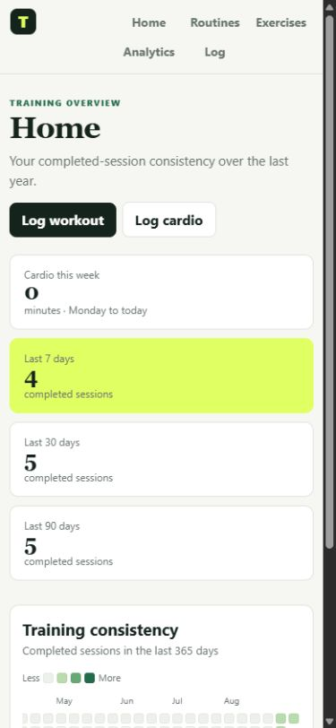
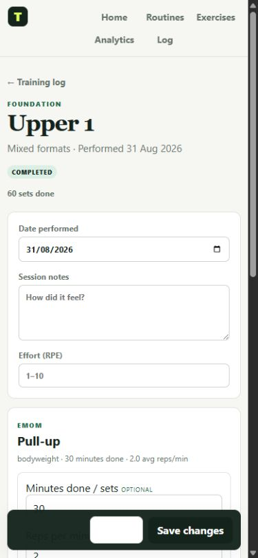
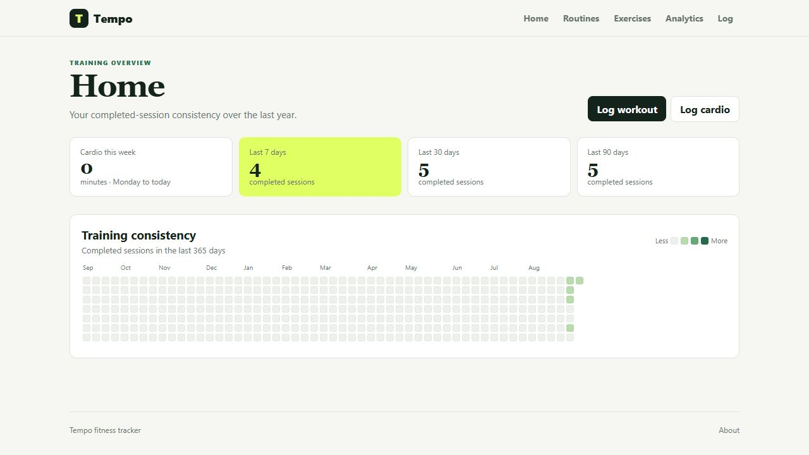
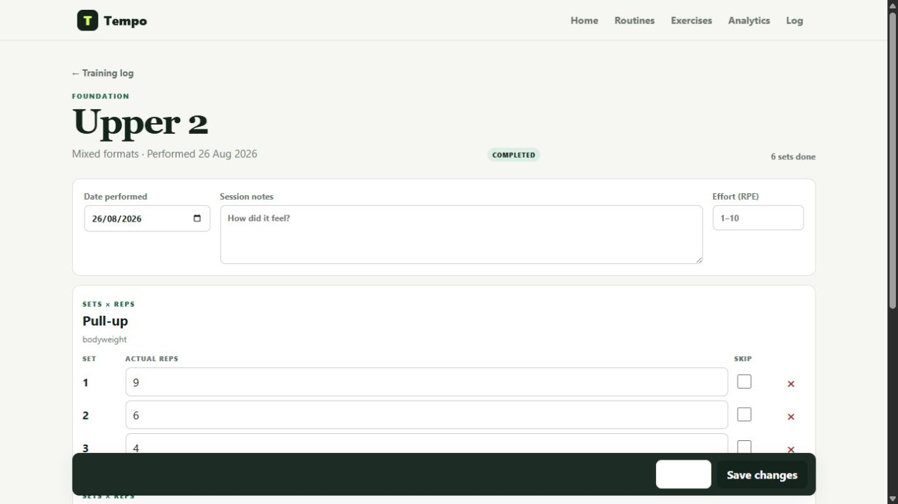
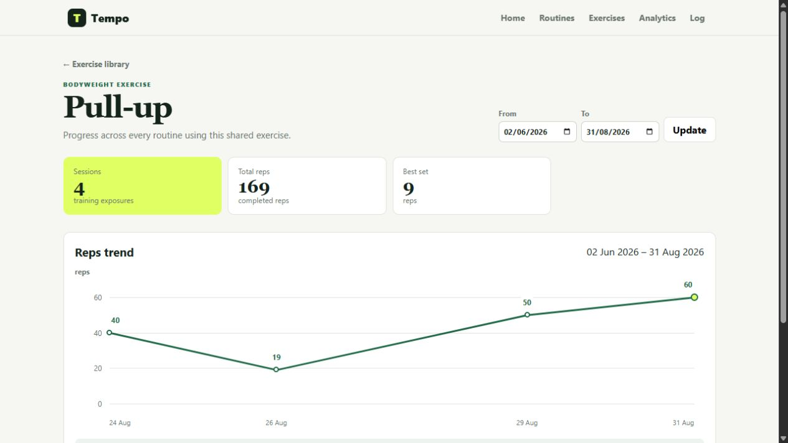

# Tempo 🏋️

**Just a simple tracker**

Tempo is a local-first fitness tracker for strength work, bodyweight training, EMOMs, and cardio.

It is mobile friendly because squinting at tiny forms between sets counts as neither training nor recovery. 📱 Dashboards stay readable, forms stack naturally, and workout actions remain within reach.

<p align="center">
  
  &nbsp;&nbsp;
  
</p>

## Keep workout logging simple 📝

- **Build your routines.** Arrange workout days, mix sets and reps with EMOM blocks, and reuse a shared exercise library. 🧱
- **Log what happened.** Start from a plan, record the real workout, save drafts, and edit completed sessions. ✅
- **Do your cardio.** Track runs, rides, walks, or custom activities. Your lungs will know either way. 🫁
- **Check your progress.** Follow consistency, strength, total reps, weighted volume, and cardio minutes over time. 📈



## When the plan meets reality 🤝

Tempo keeps target reps separate from completed reps and lets you adjust individual sets or EMOM minutes. Sometimes 10 planned reps become 7 actual reps. That discussion stays between you and gravity.



## Receipts, but for reps 📊

Each exercise gets its own history across every routine. Charts show real dates and units, because “I think I am improving” deserves better evidence than vibes.



## Try it locally 🐳

The quickest way to get Tempo running is with Docker Compose:

```sh
docker compose up --build
```

Then open [http://localhost:8080](http://localhost:8080).

When the workout is over:

```sh
docker compose down
```

Prefer another setup? Adapt Tempo to your favorite self-hosting arrangement ✌️

## How I use Tempo 🏠 → 📱

Tempo currently runs with Docker on a machine at my house, where the app and database stay on my own network. At the gym, I connect my phone to my home network through a VPN and use Tempo from there.

## Tech stack 🧰

Tempo is built with Go, Templ, HTMX, and PostgreSQL (Yes I know I suck at frontend). 
Pages work as server-rendered forms, with JavaScript adding small interaction improvements where they help.

## License 📄

[MIT](LICENSE)
